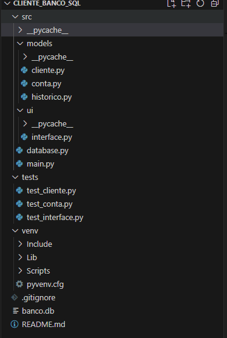

# DIOBANK - Sistema Bancário com Interface Gráfica com SQLAlchemy e Tkinter

## Descrição do Projeto

DIOBANK é um sistema bancário simplificado que utiliza a linguagem Python, com interface gráfica construída em Tkinter e banco de dados gerenciado pelo SQLAlchemy utilizando SQLite. O sistema permite cadastrar clientes, gerenciar contas bancárias e históricos de transações, visualizar e excluir dados através de uma interface amigável.

## Funcionalidades

- **Cadastro de Clientes**: Permite cadastrar novos clientes com informações como nome, CPF, endereço e tipo (Pessoa Física ou Jurídica).
- **Gerenciamento de Contas**: Permite criar contas bancárias para os clientes, incluindo agência, número da conta e saldo inicial.
- **Histórico de Transações**: Registra e visualiza transações financeiras.
- **Visualização de Dados**: Exibe listas de clientes e contas cadastradas.
- **Exclusão de Dados**: Permite excluir clientes e suas respectivas contas.
- **Limpeza da Base de Dados**: Função para limpar todos os dados do banco de dados.
- **Produtos**: Menus para acessar informações sobre cursos, bootcamps, mentorias e desafios.

## Estrutura do Projeto

## Configuração do Ambiente

Dependências

As seguintes bibliotecas são necessárias para rodar o projeto:

    tkinter: Biblioteca padrão do Python para criação de interfaces gráficas.
    sqlalchemy: Biblioteca para mapeamento objeto-relacional (ORM).
    pytest: Biblioteca para criação e execução de testes automatizados.

## Instalação das Dependências

Para instalar as dependências, utilize o comando:

pip install sqlalchemy pytest

## Como Executar o Projeto

1.Configurar o Ambiente Virtual (Opcional)

python -m venv venv
source venv/bin/activate  # No Windows: venv\Scripts\activate

2.Inicializar o Banco de Dados

O banco de dados será inicializado automaticamente ao executar o projeto.

3.Executar o Sistema

python src/main.py

## Testes Automatizados

Os testes automatizados utilizam a biblioteca pytest. Para executar os testes, utilize o comando:

pytest

## Arquitetura do Código

1.Banco de Dados (database.py)

    Configura o banco de dados SQLite utilizando SQLAlchemy.
    Define a inicialização (init_db), atualização (update_db) e limpeza (clear_db) do banco de dados.

2.Modelos (models)

    Cliente (cliente.py): Define a tabela de clientes com colunas para ID, nome, CPF, endereço e tipo.
    Conta (conta.py): Define a tabela de contas com colunas para ID, tipo, agência, número, ID do cliente e saldo.
    Histórico (historico.py): Define a tabela de históricos de transações com colunas para ID, data, histórico, saldo e ID da conta.

3.Interface Gráfica (interface.py)

    Define a classe App que cria e gerencia a interface gráfica utilizando Tkinter.
    Implementa funcionalidades para cadastro, visualização e exclusão de clientes e contas, além de produtos e limpeza da base de dados.

4.Ponto de Entrada (main.py)

    Configura o caminho de pesquisa de módulos.
    Inicializa e atualiza o banco de dados.
    Inicializa a interface gráfica e inicia o loop principal do Tkinter.

5.Testes (tests)

    test_cliente.py: Testes para criação, atualização e exclusão de clientes.
    test_conta.py: Testes para criação de contas, criação de históricos e exclusão de contas e clientes.
    test_interface.py: Testes para a interface gráfica, verificando operações de cadastro, visualização e exclusão.

## Interface Gráfica

A interface gráfica é construída utilizando a biblioteca Tkinter e possui os seguintes componentes:

    Menu Principal: Localizado à esquerda, com botões para as principais funcionalidades.
    Frame Principal: Exibe os formulários e listas de dados conforme a funcionalidade selecionada.

## Funcionalidades Implementadas na Interface

Cadastro de Cliente

Permite cadastrar um novo cliente preenchendo os campos:

    Nome
    CPF
    Endereço
    Tipo (Pessoa Física ou Jurídica)

Cadastro de Conta

Permite cadastrar uma nova conta para um cliente existente, preenchendo os campos:

    Tipo (Pessoa Física ou Jurídica)
    Agência
    CPF do Cliente
    Saldo Inicial

Visualização de Clientes

Exibe uma lista de todos os clientes cadastrados com seus respectivos dados.
Visualização de Contas

Exibe uma lista de todas as contas cadastradas com seus respectivos dados.
Exclusão de Cliente

Permite excluir um cliente e todas as suas contas associadas através do CPF.
Produtos

Menu para acessar informações sobre:

    Cursos
    Bootcamps
    Mentorias
    Desafios

Limpar Base de Dados

Permite limpar todos os dados das tabelas clientes, contas e historicos.

## Conclusão

Este projeto é uma aplicação bancária simples, ideal para entender conceitos básicos de desenvolvimento com Python, interfaces gráficas com Tkinter e banco de dados utilizando SQLAlchemy. É também um excelente ponto de partida para expandir e adicionar novas funcionalidades conforme necessário.
